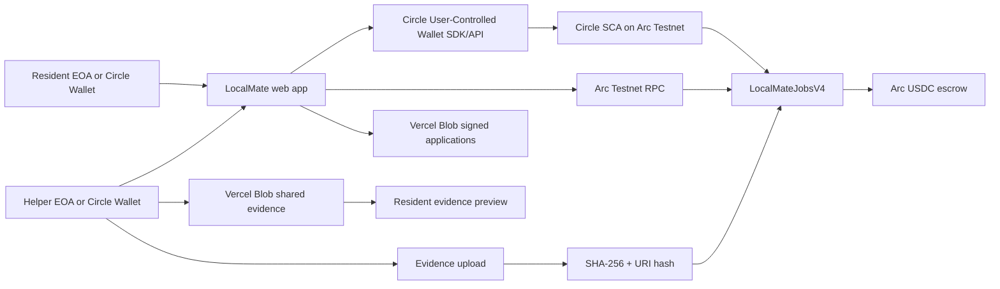

# LocalMate architecture

## What is live today

LocalMateJobsV4 is deployed at
`0x496d1ed6cd0bd0d0c426e5b12683a4daf93b3cef` on Arc Testnet and handles job creation, USDC
funding, signed helper consent, evidence anchoring, approval, refund and
dispute settlement. It verifies both EOA signatures and Circle SCA signatures
through ERC-1271. Circle's Web SDK provides Google social login, user-controlled
wallet creation/recovery and user-approved contract execution. Private task
details and evidence bytes stay off-chain; their hashes are anchored on-chain.
Evidence files are shared through public, hard-to-guess Vercel Blob URLs with
random suffixes. The app downloads each file and verifies its SHA-256 digest
against the value recorded by LocalMateJobsV4 before showing it to the Resident.
Wallet-signed Helper applications are also exchanged through Blob so Resident
and Helper can use different browsers. Blob is only the transport layer: V4
verifies the selected EOA or ERC-1271 signature before assigning the provider.

## Planned extensions

The following integrations are intentionally labelled as planned until their
own live transactions are available:

- ERC-8004: register the LocalMate matching agent and publish reputation.
- Gateway/x402: let the matching agent buy a paid Trust Review API per request.
- ERC-8183: add an adapter or migrate the V4 lifecycle to the official
  reference contract without creating a second escrow source of truth.

This separation keeps the current payout flow testable while leaving a clear
upgrade path for the Agentic Economy track.
