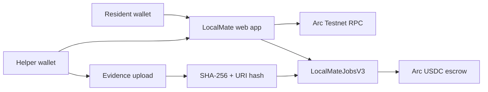

# LocalMate architecture

## What is live today

LocalMateJobsV3 is deployed on Arc Testnet and handles job creation, USDC
funding, signed helper consent, evidence anchoring, approval, refund and
dispute settlement. Private task details and evidence bytes stay off-chain;
the evidence hash and URI hash are anchored on-chain.

## Planned extensions

The following integrations are intentionally labelled as planned until their
own live transactions are available:

- ERC-8004: register the LocalMate matching agent and publish reputation.
- Gateway/x402: let the matching agent buy a paid Trust Review API per request.
- ERC-8183: add an adapter or migrate the V3 lifecycle to the official
  reference contract without creating a second escrow source of truth.

This separation keeps the current payout flow testable while leaving a clear
upgrade path for the Agentic Economy track.
